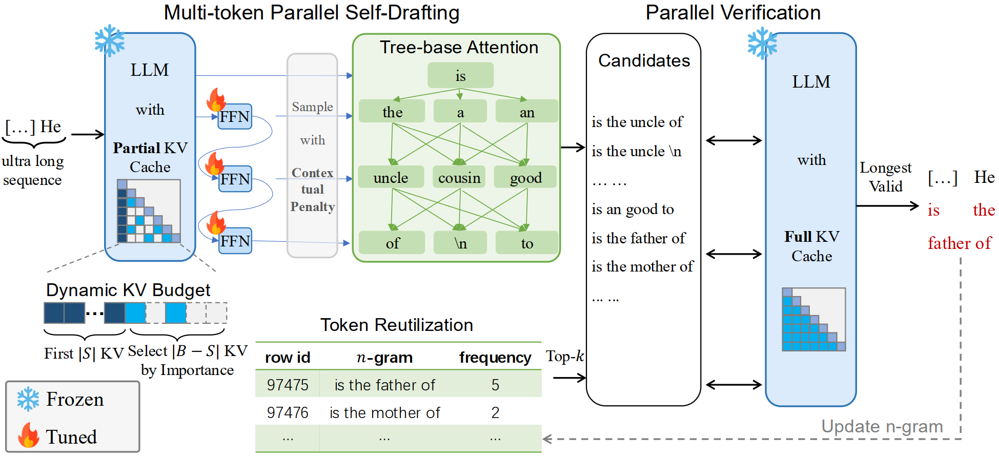
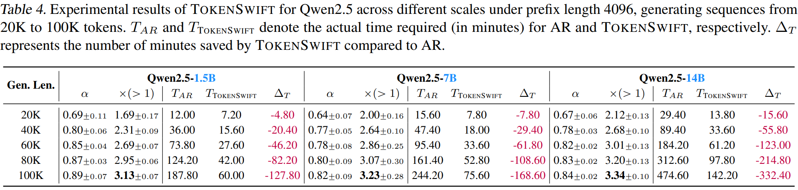

# 🚀 From Hours to Minutes: Achieving Lossless Acceleration in 100K-Token Long Sequence Generation

✨ **A Breakthrough in Long-Sequence Generation Efficiency**  
*A PyTorch Implementation of Our Paper* [**[Paper Link]**](#)  

---

## 📖 Overview


We propose **TokenSwift**, a novel framework that achieves **lossless acceleration** for ultra-long sequence generation (up to 100K tokens) while **reducing computation time from hours to minutes**. This repository contains:
- ✅ **100% reproducibility** for all experiments
- 📊 Benchmark scripts for sequence lengths: 20K/40K/60K/80K/100K
- 🤖 Pre-trained model adapters for Any Structure

 
*Visualization of our acceleration performance vs. baseline methods*

---

## 🌟 Key Features
| Feature          | Description                                  | Emoji |
|------------------|----------------------------------------------|-------|
| ⚡ **Speed**      | 3× faster than vanilla Transformers      | ⏩    |
| 🎯 **Lossless**   | Matches original model's output quality      | ✅    |
| 📈 **Scalability**| Linear time complexity for 100K+ sequences   | 📏    |
| 🛠️ **Plug & Play**| Works with most HuggingFace models           | 🤗    |

---

## 🛠️ Installation
```bash
git clone https://github.com/bigai-nlco/TokenSwift.git
cd TokenSwift
conda create -n tokenswift python=3.11
conda activate tokenswift
pip install -r requirements.txt
```

---

## 📦 Data & Models Download
### Dataset
> From the [PG-19](https://huggingface.co/datasets/deepmind/pg19) training set, data larger than 8K are filtered out according to different tokenizer.

> Or download processed training datasets from [llama2-pg19](https://huggingface.co/datasets/TokenSwift/llama2_pg19_train_data), [llama3.1-pg19](https://huggingface.co/datasets/TokenSwift/llama3.1_pg19_train_data), [qwen2.5-pg19](https://huggingface.co/datasets/TokenSwift/qwen2.5_pg19_train_data).
### Fine-tuned Models
| Model Name | Download Link |
|------------|-------------|
| TokenSwift-Yarn-Llama-2-7b-128k | [HuggingFace](https://huggingface.co/TokenSwift/TokenSwift-Yarn-Llama-2-7b-128k) |
| TokenSwift-Llama-3.1-8B | [HuggingFace](https://huggingface.co/TokenSwift/TokenSwift-Llama-3.1-8B) |
| TokenSwift-Qwen2.5-1.5B | [HuggingFace](https://huggingface.co/TokenSwift/TokenSwift-Qwen2.5-1.5B) |
| TokenSwift-Qwen2.5-7B | [HuggingFace](https://huggingface.co/TokenSwift/TokenSwift-Qwen2.5-7B) |
| TokenSwift-Qwen2.5-14B | [HuggingFace](https://huggingface.co/TokenSwift/TokenSwift-Qwen2.5-14B) |
| TokenSwift-DeepSeek-R1-Distill-Qwen-32B | [HuggingFace](https://huggingface.co/TokenSwift/TokenSwift-DeepSeek-R1-Distill-Qwen-32B) |

---

## 🏋️ Training Guide (Option)
```bash
cd train
bash scripts/train_R1_qwen2_5_32b.sh
```
*NOTE: Modify the data and model path.*

---

## 🧠 Inference Guide
```bash
bash infer_scripts/r1_qwen_32b.sh
```
*NOTE: Modify the data and model path.*

---

## 📚 Citation
```bibtex

```