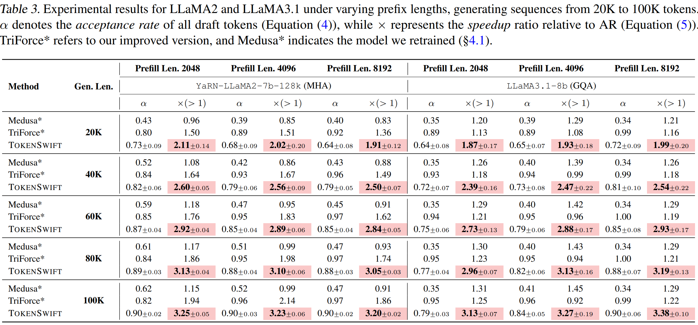

# 🚀 From Hours to Minutes: Achieving Lossless Acceleration in 100K-Token Long Sequence Generation

<p align="center">
| <a href="https://bigai-nlco.github.io/TokenSwift/"><b>Blog</b></a> | <a href="https://arxiv.org/abs/2502.18890"><b>Paper</b></a> |
</p>

## 🌟 Key Highlights
| Highlights          | Description                                  | Emoji |
|------------------|----------------------------------------------|-------|
| ⚡ **Speed**      | 3× faster than vanilla Transformers      | ⏩    |
| 🎯 **Lossless**   | Matches original model's output quality      | ✅    |
| 📈 **Scalability**| Linear time complexity for 100K+ sequences   | 📏    |
| 🛠️ **Plug & Play**| Works with most HuggingFace models           | 🤗    |

---

## ✨ News

[2025.2.27] Paper Release on Arxiv.

---

## 📦 Demo
https://github.com/user-attachments/assets/5094fca7-0b12-470c-a7b6-456d254855d1

---

## 📖 Table of contents
- [Introduction](#introduction)
- [Installation](#installation)
  - [From the source (recommended)](#from-the-source-recommended)
- [Inference](#inference)
  - [Models Download](#models-download)
  - [Getting Start](#getting-start)
- [Training Guide (Option)](#training-guide-option)
  - [Datasets Download](#datasets-download)
  - [How to Train](#how-to-train)
- [Citation](#citation)
- [Acknowledgment](#acknowledgment)

---

## Introduction
We propose **TokenSwift**, a novel framework that achieves **lossless acceleration** for ultra-long sequence generation (up to 100K tokens) while **reducing computation time from hours to minutes**. 


*Illustration of TOKENSWIFT Framework. First, target model (LLM) with partial KV cache and three linear layers outputs 4 logits in a single forward pass. Tree-based attention is then applied to construct candidate tokens. Secondly, top-k candidate 4-grams are retrieved accordingly. These candidates compose draft tokens, which are fed into the LLM with full KV cache to generate target tokens. The verification is performed by checking if draft tokens match exactly with target tokens. Finally, we randomly select one of the longest valid draft tokens, and update n-gram table and KV cache accordingly.*

This repository contains:
- ✅ **100% reproducibility** for all experiments
- 📊 Benchmark scripts for sequence lengths: 20K/40K/60K/80K/100K
- 🤖 Pre-trained model adapters for Any Structure

 
*Visualization of our acceleration performance vs. baseline methods*

---

## Installation

### From the source (recommended)
```bash
git clone https://github.com/bigai-nlco/TokenSwift.git
cd TokenSwift
conda create -n tokenswift python=3.11
conda activate tokenswift
conda install nvidia::cuda-nvcc
pip install -r requirements.txt
pip install https://github.com/Dao-AILab/flash-attention/releases/download/v2.7.4.post1/flash_attn-2.7.4.post1+cu12torch2.4cxx11abiFALSE-cp311-cp311-linux_x86_64.whl
```

---

## Inference

### Models Download
| Model Name | Download Link |
|------------|-------------|
| TokenSwift-Yarn-Llama-2-7b-128k | [HuggingFace](https://huggingface.co/TokenSwift/TokenSwift-Yarn-Llama-2-7b-128k) |
| TokenSwift-Llama-3.1-8B | [HuggingFace](https://huggingface.co/TokenSwift/TokenSwift-Llama-3.1-8B) |
| TokenSwift-Qwen2.5-1.5B | [HuggingFace](https://huggingface.co/TokenSwift/TokenSwift-Qwen2.5-1.5B) |
| TokenSwift-Qwen2.5-7B | [HuggingFace](https://huggingface.co/TokenSwift/TokenSwift-Qwen2.5-7B) |
| TokenSwift-Qwen2.5-14B | [HuggingFace](https://huggingface.co/TokenSwift/TokenSwift-Qwen2.5-14B) |
| TokenSwift-DeepSeek-R1-Distill-Qwen-32B | [HuggingFace](https://huggingface.co/TokenSwift/TokenSwift-DeepSeek-R1-Distill-Qwen-32B) |

### Getting Start
```bash
bash infer_scripts/r1_qwen_32b.sh

<NOTE: Modify the model path>
```

---

## Training Guide (Option)

### Datasets Download
From the [PG-19](https://huggingface.co/datasets/deepmind/pg19) training set, data larger than 8K are filtered out according to different tokenizer.

Or download processed training datasets from [llama2-pg19](https://huggingface.co/datasets/TokenSwift/llama2_pg19_train_data), [llama3.1-pg19](https://huggingface.co/datasets/TokenSwift/llama3.1_pg19_train_data), [qwen2.5-pg19](https://huggingface.co/datasets/TokenSwift/qwen2.5_pg19_train_data).

### How to Train
```bash
cd train
bash scripts/train_R1_qwen2_5_32b.sh
<NOTE: Modify the data and save path>
```

---

## Citation
```bibtex
@misc{wu2025hoursminuteslosslessacceleration,
      title={From Hours to Minutes: Lossless Acceleration of Ultra Long Sequence Generation up to 100K Tokens}, 
      author={Tong Wu and Junzhe Shen and Zixia Jia and Yuxuan Wang and Zilong Zheng},
      year={2025},
      eprint={2502.18890},
      archivePrefix={arXiv},
      primaryClass={cs.CL},
      url={https://arxiv.org/abs/2502.18890}, 
}
```

## Acknowledgment
This codebase is influenced by remarkable projects from the LLM community, including [Medusa](https://github.com/FasterDecoding/Medusa/tree/main) and [TriForce](https://github.com/Infini-AI-Lab/TriForce).
